# 도당동 아카이브 디자인 시스템

이 문서는 도당동 아카이브가 **어떻게 생겼고 왜 그렇게 생겼는지** 적는다.
모든 스크린샷은 실제 사이트를 찍은 것이다(`docs/design/`). 값의 원천은 `design/tokens.json` 이고,
`npm run tokens` 가 그것으로 `src/app/tokens.css` 를 만든다. 나머지 규칙은 `src/app/globals.css` 에 있다.

> 스크린샷은 가상 시험 자료로 찍었다. 제목 끝의 "(시험)"은 그 표시다.
> 사진 대신 보이는 흑백 무늬도 시험용으로 만든 가짜 사진이다.

- [1. 원칙](#1-원칙)
- [2. 색](#2-색)
- [3. 글자](#3-글자)
- [4. 간격·선·그림자](#4-간격선그림자)
- [5. 배치](#5-배치)
- [6. 부품](#6-부품)
- [7. 화면](#7-화면)
- [8. 밝은 화면 하나뿐](#8-밝은-화면-하나뿐)
- [9. 좁은 화면](#9-좁은-화면)
- [10. 접근성](#10-접근성)
- [11. 하지 않는 것](#11-하지-않는-것)
- [12. 알려진 틈](#12-알려진-틈)
- [13. 고치는 법](#13-고치는-법)

---

## 1. 원칙

**흑백 픽셀 아트 위에 기록을 올려 둔다.** 화면은 오래된 컴퓨터의 창처럼 단단하고 조용하다.
그 안에서 유일하게 풍부한 색은 사진이다.

| 원칙 | 화면에서는 |
| --- | --- |
| 기록이 주인공이다 | 장식 픽셀, 아이콘 더미, 배경 무늬를 더하지 않는다. 디더 무늬는 "여기 사진이 없다"는 자리에만 깐다 |
| 선은 2px, 모서리는 직각 | 모든 테두리·구분선은 `--stroke`(2px) 또는 `--stroke-heavy`(4px). `border-radius` 는 0 하나뿐이다 |
| 그림자는 계단 | 흐림 없는 4px 오프셋(`--shadow-pixel`). 떠 있는 것은 누를 수 있는 것이다 |
| 메타데이터는 숨기지 않는다 | 상세정보 표를 설명 바로 아래에 펼친다. 접지 않는다 |
| 모르는 것은 모른다고 쓴다 | `1978?`, `197X`, "기록 없음". 값을 지어내지 않는다 |
| 비공개는 조용히 빠진다 | 자물쇠도, "N건 숨김"도 없다. 손님 화면에는 처음부터 없는 것처럼 보인다 |
| 움직이지 않는다 | 전환 효과·애니메이션·자동 넘김이 없다(`transition: none !important`). 상태는 한 번에 바뀐다. **예외는 둘뿐이다** — 인트로(7장)와 녹취록 재생기(9장). 둘 다 사람이 부른 움직임이다 |

---

## 2. 색

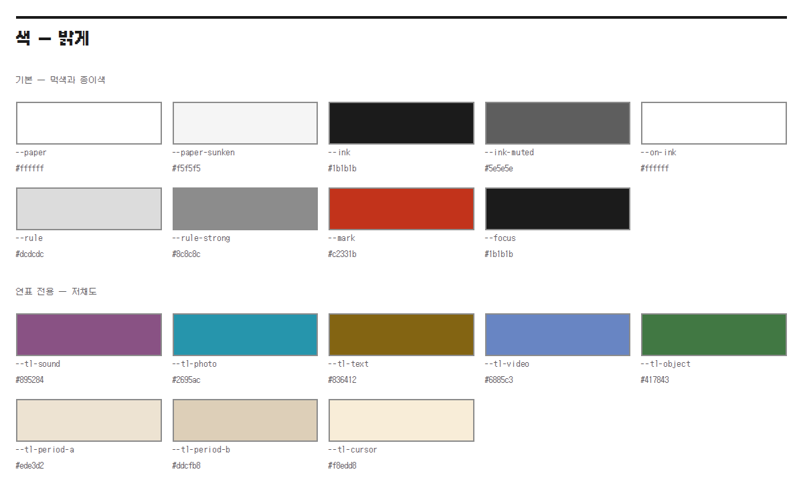

색은 **먹색과 종이색** 두 가지로 끝낸다. 회색 단계는 그 사이를 잇는 용도로만 둔다.

| 토큰 | 값 | 종이 위 대비 | 쓰는 곳 |
| --- | --- | --- | --- |
| `--paper` | `#ffffff` | — | 페이지 바탕, 카드 바탕 |
| `--paper-sunken` | `#f5f5f5` | — | 한 단계 들어간 면: 입력칸, 상세정보 표의 요소명 칸, 썸네일 자리, 지금 녹취록 구간 |
| `--ink` | `#1b1b1b` | 17.2 | 글자, 기본 버튼 채움, 강한 구분선, 가계도 선 |
| `--ink-muted` | `#5e5e5e` | 6.5 | 보조 글자: 날짜, 식별자, 요소 코드, 도움말 |
| `--on-ink` | `#ffffff` | — | `ink` 로 채운 면 위의 글자(기본 버튼, 고른 필터·칩) |
| `--rule` | `#dcdcdc` | 1.4 | 장식 구분선(표의 행 사이), 디더 무늬. 의미를 싣지 않는 곳에만 |
| `--rule-strong` | `#8c8c8c` | 3.4 | 조작할 수 있음을 알리는 선: 입력칸·보조 버튼·칩 테두리 |
| `--mark` | `#c2331b` | 5.6 | **인장색.** 증빙으로 확인된 날짜("확인됨")와 확인된 사건 네모에만 쓴다 |
| `--focus` | = `ink` | 17.2 | 키보드 포커스 링 |

### 인장색 `mark` 의 규칙

- 아카이브에서 유일한 채도 있는 색이다. **"이 날짜는 증빙으로 확인했다"는 사실 하나만** 뜻한다.
- 장식, 강조, 링크, 오류, 경고에 쓰지 않는다. 오류도 먹색으로 적는다(`.notice`).
- 연표의 자료 칸에 두르지 않는다. 그러면 "빨강"이라는 자료 유형이 하나 더 있는 것처럼 읽힌다.

### 연표 전용 저채도 팔레트 `tl-*`

생애 띠와 연표에서 **자료 유형을 구분할 때만** 색을 쓴다. 나머지 UI 는 무채색 그대로다.

| 토큰 | 값 | 뜻 |
| --- | --- | --- |
| `--tl-sound` | `#895284` | 음성 — 쌓는 순서 1(맨 아래) |
| `--tl-photo` | `#2695ac` | 사진 — 2 |
| `--tl-text` | `#836412` | 문서 — 3 |
| `--tl-video` | `#6885c3` | 영상 — 4 |
| `--tl-object` | `#417843` | 실물 — 5(맨 위) |
| `--tl-period-a` / `-b` | `#ede3d2` / `#ddcfb8` | 인생 시기 띠(번갈아 칠함). 빛바랜 종이색 |
| `--tl-cursor` | `#f8edd8` | 지금 펼친 연대를 띠 전체에 가로질러 짚는 바탕 |

- 채도를 낮춰(OKLCH C≈0.10) 레트로한 인쇄물처럼 보이게 했다.
- 쌓는 순서는 색맹 시뮬레이션에서 이웃한 색끼리 ΔE 9.7 이상 떨어지도록 골랐다.
- 빨강 계열은 넣지 않았다. 인장색 `mark` 와 헷갈리지 않게 하기 위해서다.
- 색만으로 뜻을 전하지 않는다. 범례에는 늘 이름을 함께 쓴다.

---

## 3. 글자

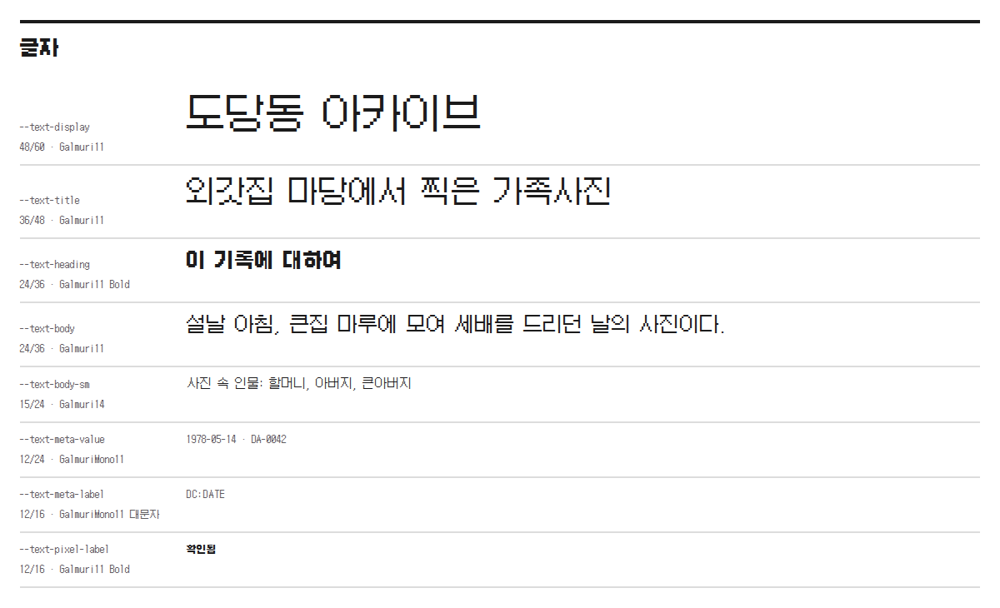

글꼴은 **갈무리**(Galmuri) 하나뿐이다. 인트로까지 그렇다.
갈무리는 픽셀 글꼴이라 **정해진 크기의 정수배에서만 선명하다.**

- Galmuri11 은 12px 격자다(글꼴 단위로 한 픽셀이 100, 1em 이 1200).
- Galmuri14 는 15px 격자다.
- 그래서 크기를 12·24·36·48 과 15 에서만 고른다. 16px, 20px 같은 크기는 쓰지 않는다.

| 토큰 | 크기/줄 간격 | 글꼴 | 한 픽셀 | 쓰는 곳 |
| --- | --- | --- | --- | --- |
| `--text-display` | 48/60 | Galmuri11 | 4px | 첫 화면의 사이트 이름. 한 화면에 하나 |
| `--text-title` | 36/48 | Galmuri11 | 3px | 페이지 제목, 자료 제목(dc:title), 연표의 해, 인물 이름 |
| `--text-heading` | 24/36 **굵게** | Galmuri11 Bold | 2px | 섹션 제목, 카드 제목, 필터 묶음 제목. 본문과 같은 크기라 굵기로 구분한다 |
| `--text-body` | 24/36 | Galmuri11 | 2px | **읽는 글 전부**: 설명, 이야기 본문, 상세정보 값, 녹취록, 연표의 집안 일·자료 줄, 인물의 사실 |
| `--text-body-sm` | 15/24 | Galmuri14 | 1px | 보조 글: 카드 요약, 목록 설명, 메뉴, 버튼, 입력칸, 필터, 도움말 |
| `--text-meta-value` | 12/24 | GalmuriMono11 | 1px | 기계가 읽는 값: 날짜(ISO 8601), 식별자, 건수, 파일 형식 |
| `--text-meta-label` | 12/16, 자간 0.06em, 대문자 | GalmuriMono11 | 1px | 요소 코드(`dc:date`), DCMI 유형 코드(`STILLIMAGE`), 입력칸 이름표 |
| `--text-pixel-label` | 12/16 굵게 | Galmuri11 Bold | 1px | 짧은 표식: "확인됨", "공개", 히어로 꼬리표 |

### 글자 규칙

- **읽는 글은 24px 이다.** 제목(36·24 굵게) 아래에서 글이 반으로 줄어들지 않게 한다. 예전에는 11px 로 떨어지던 곳들이 있었다.
- **15px(Galmuri14)는 굵게 쓰지 않는다.** 굵은체가 없어서 브라우저가 흉내 낸 굵은 글씨가 나온다. 구분이 필요하면 면(`paper-sunken`)이나 색(`ink-muted`)을 쓴다.
- **12px 에는 문장을 두지 않는다.** 날짜·식별자·딱지만 둔다.
- 숫자로 된 값(날짜·식별자)은 고정폭 GalmuriMono11 로 쓴다. 날짜가 곧 값인 칸(인물의 생몰)은 고정폭을 두고 크기만 본문을 따른다.
- 픽셀 격자가 살도록 안티앨리어싱을 끈다(`-webkit-font-smoothing: none`).
- 본문 폭은 `--measure`(770px)를 넘지 않는다. 한 줄에 한글 약 32자다.

---

## 4. 간격·선·그림자

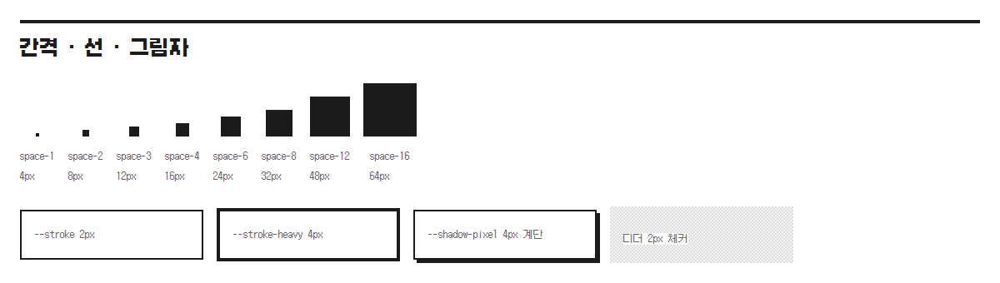

| 토큰 | 값 | 쓰는 곳 |
| --- | --- | --- |
| `--space-1` | 4px | 딱지 안쪽, 목록 줄 사이 |
| `--space-2` | 8px | 부품 안의 작은 틈 |
| `--space-3` | 12px | 입력칸 위아래 안쪽, 섹션 제목 위 |
| `--space-4` | 16px | 카드 안쪽, 좁은 화면의 페이지 옆 여백 |
| `--space-6` | 24px | 카드 격자 사이, 섹션 제목 아래 |
| `--space-8` | 32px | 큰 덩어리 사이 |
| `--space-12` | 48px | 섹션 사이 |
| `--space-16` | 64px | 넓은 화면의 페이지 옆 여백, 꼬리말 위 |
| `--stroke` | 2px | 모든 테두리·구분선. 본문 24px 에서 글자 한 픽셀과 같다 |
| `--stroke-heavy` | 4px | 섹션을 여는 선, 표의 머리 선, 알림, 가계도의 "나" |
| `--shadow-pixel` | 4px 4px 0 `#1b1b1b` | 버튼, 카드에 마우스를 올렸을 때, 가계도의 "나" |
| `--radius-0` | 0 | 모든 모서리 |

- 간격은 4의 배수다. 글자 격자(12·24)와 잘 맞는다.
- **디더**: 2px 체커(`rule` + `paper-sunken`, 4×4 반복)는 "사진이 없는 자리"에만 깐다. 빈 썸네일, 인물 얼굴 자리, 사진 없는 히어로가 여기에 해당한다.

---

## 5. 배치

- 페이지 폭은 `--page-max` 1200px 이다. 옆 여백은 16px, 900px 이상에서는 64px 이다.
- 섹션은 **4px 먹색 선으로 연다**(`.section-title`). 제목은 왼쪽, 건수나 요소 코드는 오른쪽에 둔다.
- 격자와 중단점

| 부품 | 1열 | 2열 | 3~4열 |
| --- | --- | --- | --- |
| 카드 격자 `.grid` | ~619px | 620px~ | 1000px~ (4열) |
| 인물 카드 `.person-grid` | ~619px | 620px~ | 1000px~ (3열) |
| 이야기 카드 `.story-grid` | ~759px | 760px~ | — |
| 자료 찾기 `.search-layout` | ~899px | 900px~ (필터 240px + 결과) | — |
| 상세정보 표 `.meta-row` | ~559px(요소명 위, 값 아래) | 560px~ (220px + 값) | — |
| 히어로 `.hero-slide` | ~859px(사진 위, 글 아래) | 860px~ (글 · 사진) | — |
| 연표 해별 `.year-cols` | ~899px | — | 900px~ (1 : 2 : 1) |

---

## 6. 부품

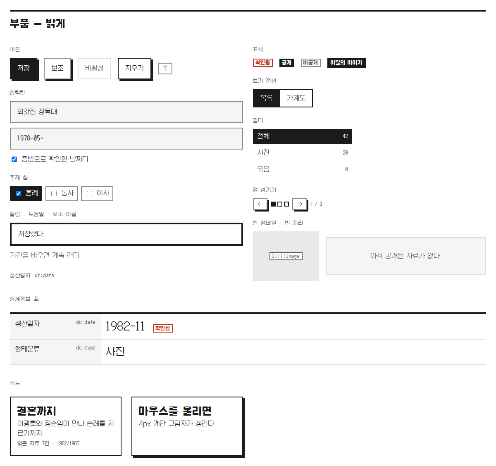

### 머리와 관리 띠

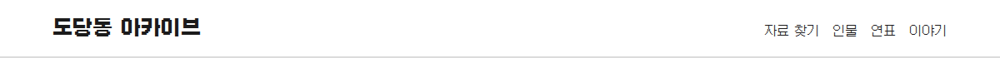

- `.site-head` 는 모든 공개 화면 맨 위에 있다. 왼쪽에 사이트 이름(heading), 오른쪽에 메뉴 넷(body-sm)을 둔다. 아래는 2px `rule` 선이다.
- 좁으면 메뉴가 이름 아래 줄로 내려간다. **낱말은 가운데서 끊지 않는다**(`white-space: nowrap`).
- 로그인 링크는 머리에 두지 않는다. 꼬리말의 "관리" 하나로만 간다.

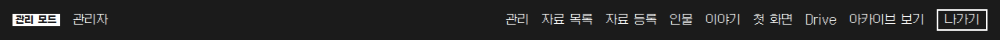

- `.adminbar` 는 관리 화면임을 알리는 **유일한** 표시다. 먹색 띠에 "관리 모드" 딱지, 관리자 이름, 관리 메뉴, 나가기를 둔다.

### 버튼

| 종류 | 클래스 | 생김새 |
| --- | --- | --- |
| 기본 | `.button` | `ink` 채움, `on-ink` 글자, 4px 계단 그림자. 누르면 그림자가 사라지고 4px 내려앉는다 |
| 보조 | `.button.is-secondary` | 종이색 채움, `rule-strong` 테두리 |
| 비활성 | `.button[disabled]` | 그림자 없음, `ink-muted` 글자 |
| 지우기 | `.button.is-danger` | 종이색. **빨강을 쓰지 않는다.** 지우기는 4px 테두리 상자와 식별자 입력으로 막는다 |
| 도구 | `.tool` | 작은 보조 버튼(이야기 블록 ↑↓) |

- 버튼 글자는 줄바꿈하지 않는다. 좁은 자리에서 "찾/기"처럼 쪼개지지 않게 한다.

### 입력

- `.field`: `paper-sunken` 면에 `rule-strong` 2px 테두리, body-sm 글자. 날짜·식별자 칸은 `.field.is-mono` 로 쓴다.
- `.label` 은 12px 대문자 이름표다. 옆의 `.label-code` 가 더블린코어 요소(`dc:date`)를 소문자로 밝힌다.
- `.help` 는 입력칸 아래의 도움말이다(body-sm, `ink-muted`).
- `.chip`(주제·인물 고르기): 고르면 `ink` 로 채운다.
- `.notice`: 4px 먹색 테두리 상자다. 저장 완료와 오류를 모두 이것으로 알린다(색 없음).
- **목록 상자**(`select.field`): 펼친 목록의 항목도 갈무리 15px 이다.
  - 목록을 직접 꾸밀 수 있는 브라우저(Chrome·Edge 135+, `appearance: base-select`)에서는 펼친 목록도 픽셀 창이다. 2px 먹색 테두리에 계단 그림자, 고른 항목은 먹색 채움과 ■ 표시, 열림·닫힘은 ▲·▼ 로 보인다.
  - 그 밖의 브라우저는 기본 목록에 글꼴만 입는다. macOS·iOS·Android 는 운영체제가 목록을 그려 글꼴도 바뀌지 않는다.

### 툴팁

- 브라우저 기본 툴팁(`title`)은 쓰지 않는다. 운영체제 글꼴로 그려지기 때문이다.
- 요소에 `data-tip` 을 달면 **픽셀 툴팁**(`TipLayer`, `.tip`)이 뜬다. 먹색 면에 갈무리 15px, 계단 그림자다.
- 마우스를 올릴 때와 키보드로 포커스할 때 모두 뜬다. 화면 위에 하나만 떠서, 가로로 밀어 보는 상자 안에서도 잘리지 않는다. 폭은 내용만큼 잡고, 화면 가장자리에서는 안쪽으로 붙으며, 위에 자리가 없으면 요소 아래로 내려간다. 여러 줄을 담을 수 있다(`\n`).
- 같은 내용을 `aria-label` 로도 달아 화면 읽기 프로그램이 읽게 한다. 지금은 생애 띠의 해 막대와 인생 시기에 쓴다.

### 표식

| | 클래스 | 뜻 |
| --- | --- | --- |
| 확인됨 | `.verified` | 인장색 테두리와 글자. 증빙으로 확인된 날짜 옆에만 |
| 공개 / 비공개 | `.badge.is-public` / `.badge` | 관리 목록에서만. 공개는 먹색 채움, 비공개는 테두리만(색이 아니라 모양으로 구분) |
| 히어로 꼬리표 | `.hero-kind` | 먹색 채움. "이달의 이야기", "오늘, N년 전", "새로 들어온 기록" |

### 카드와 썸네일

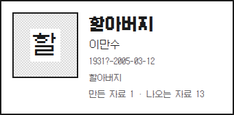

- `.card`: 2px 먹색 테두리. 마우스를 올리면 4px 계단 그림자가 생긴다.
- 썸네일(`.thumb`)은 4:3 으로 채워 자른다. **필터·세피아를 입히지 않는다.**
- 사진이 없으면 `.thumb-empty` 를 쓴다. 디더 위에 DCMI 유형 코드(`StillImage`, `Text`)를 적은 딱지를 둔다.
- 인물 얼굴 자리(`.face`)도 디더 위에 호칭 첫 글자를 둔다.

### 상세정보 표

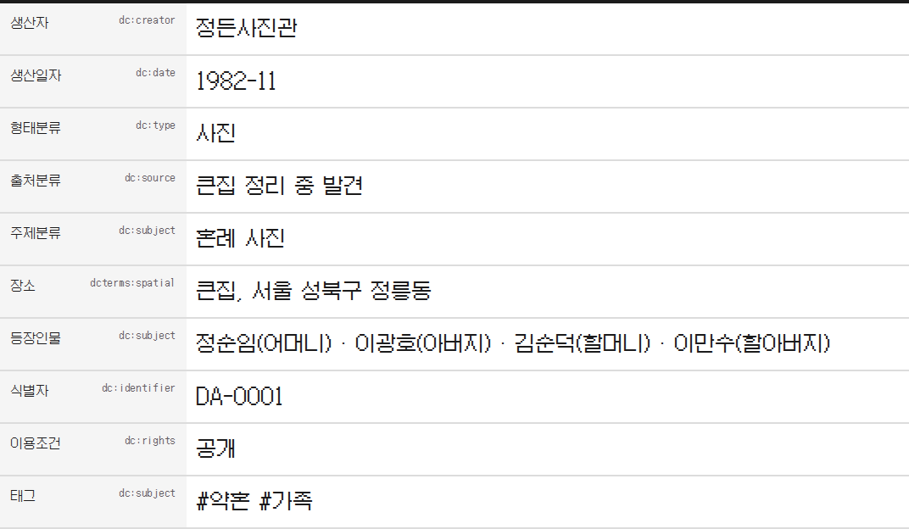

- 더블린코어 요소를 **정해진 순서로** 펼친다. 순서는 생산자 → 생산일자 → 형태분류 → 출처 → 주제 → 장소 → 등장인물 → … → 이용조건이다.
- 요소명 칸은 `paper-sunken` 면에 body-sm 으로 쓰고, 오른쪽에 요소 코드를 둔다. 값은 **본문 24px** 이다.
- 값이 없는 행은 손님 화면에서 숨긴다. "기록 없음"은 관리 화면에서만 보인다.

### 자료 찾기 — 필터와 결과

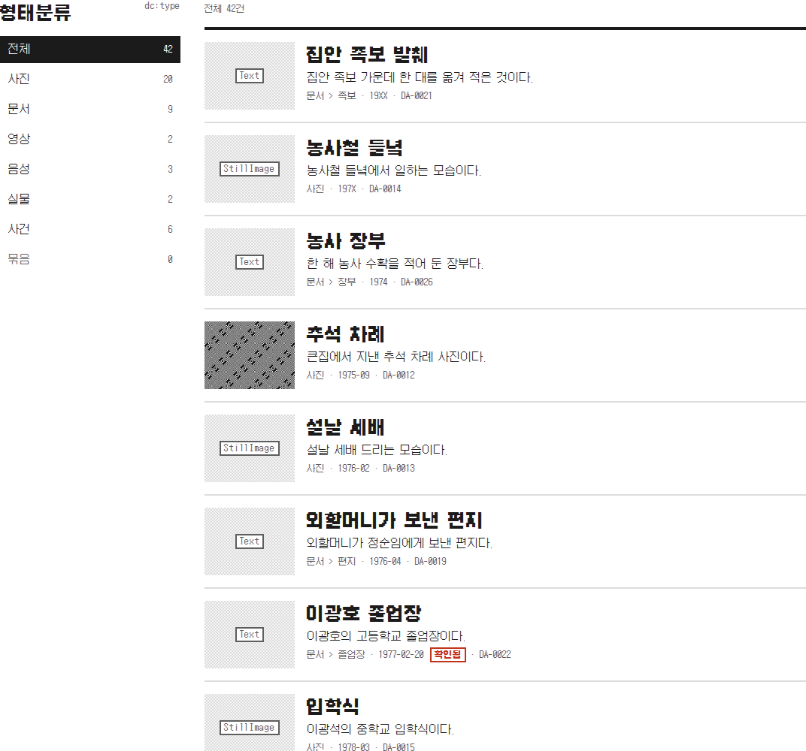

- 필터(`.facet`)는 고른 것만 먹색으로 채운다. 건수가 0인 항목은 `ink-muted` 로 남긴다.
- 결과 한 줄은 썸네일(120px), 제목(heading), 설명(body-sm, 두 줄에서 자름), 메타(형태 > 세부 · 날짜 · 식별자)로 이룬다.

### 히어로

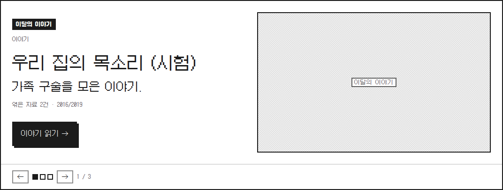

- 첫 화면의 이야기 자리 셋이다. 2px 먹색 상자 안에 왼쪽은 글, 오른쪽은 사진 콜라주(1~3장을 겹쳐 둠)다.
- 사진이 없는 이야기는 디더 면에 꼬리표만 둔다.
- 넘기기는 ←/→ 버튼, 네모 점, 키보드 ←/→ 로 한다. **자동으로 넘기지 않는다.** 모든 장을 미리 그려 두고 한 장만 보인다.

### 녹취록

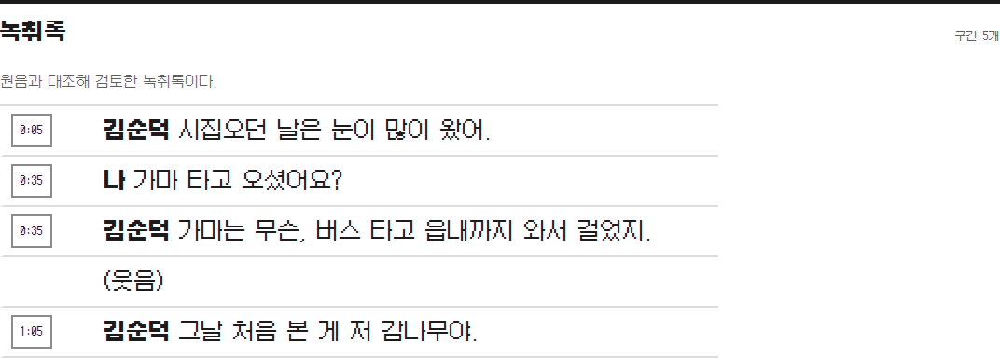

- 왼쪽 96px 은 시각 칸, 오른쪽은 말이다. 말한 사람은 굵게 쓴다. 말은 본문 24px 이다.
- 시각은 누를 수 있는 작은 보조 버튼이다. 누르면 그 자리부터 재생한다.
- 재생 중인 구간은 **왼쪽 4px 먹색 선 + `paper-sunken` 면**으로 짚는다. 구술 인용과 같은 문법이다.
- 검토 여부는 글로 알린다("아직 원음과 대조하지 않은 녹취록이다…").

### 연표 — 연대 막대와 해별 펼침

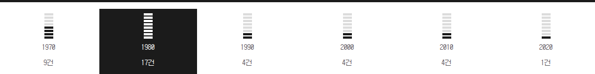

- 연대마다 세로 막대 하나를 둔다. 4px 칸 8개로 자료 양을 보인다. 고른 연대는 먹색으로 채우고, 자료가 없는 연대는 흐리게 한다.

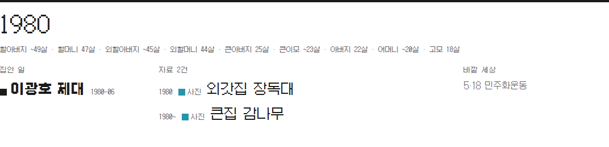

- 해(title 36) 아래에 그해 가족들의 나이를 `실명 ~XX세 | 실명 XX세` 로 적고(호칭이 아니라 실명, 가름대는 `|`, 추정 생년은 `~`), 세 칸(집안 일 · 자료 · 바깥 세상)을 둔다. 한 사람의 이름과 나이는 줄 끝에서 쪼개지지 않는다.
- 집안 일은 먹색 네모와 굵은 제목으로 쓴다. 자료는 유형 색 칩과 유형 이름으로 쓴다. 바깥 세상은 `ink-muted` 로 쓴다.

### 생애 띠

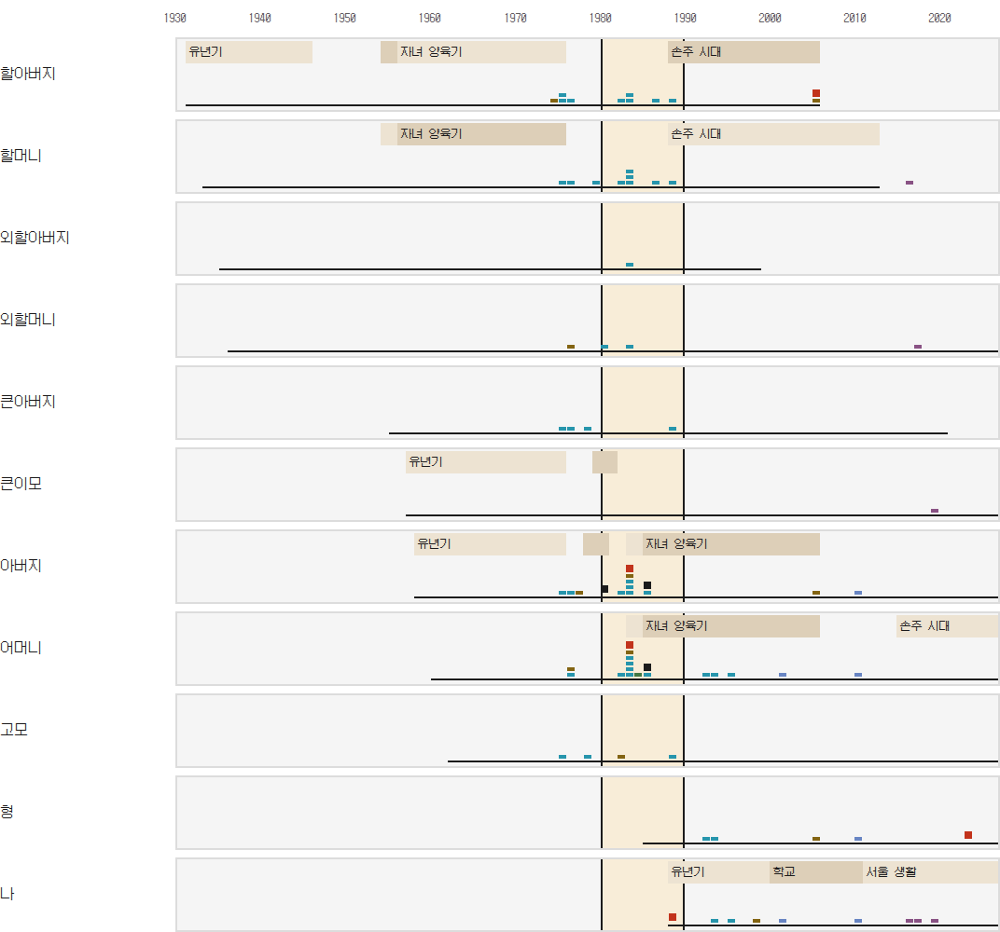

- 한 사람에 한 줄이다. 가는 먹색 선은 살아온 기간, 위쪽 옅은 띠는 인생 시기(번갈아 칠함)다.
- 해마다 막대 하나를 둔다. **자료 한 건이 4px 칸 하나**이고, 유형 색으로 아래부터 쌓는다(음성 → 사진 → 문서 → 영상 → 실물).
- 사건은 먹색 네모, 증빙으로 확인된 사건은 인장색 네모다.
- 막대에 마우스를 올리면 그해 자료가 한 줄에 하나씩 **"제목 | 연도 | 분류"**로 뜬다(날짜 순, 8건까지, 나머지는 "외 N건").
- 막대를 누르면 연표의 그해로 간다. 지금 펼친 연대는 `tl-cursor` 로 띠 전체를 가로질러 짚는다.
- 좁은 화면에서는 가로로 밀어 보고, 이름 칸은 왼쪽에 붙어 있다(`position: sticky`).

### 가계도

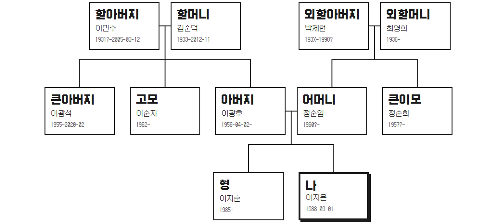

- 세대별로 층을 쌓는다. 부부는 나란히 두고 **혼인선**으로 잇는다. 자녀는 혼인선 가운데에서 내려오는 **직각 선**에 매단다.
- 선은 모두 2px 먹색이고 SVG 로 그린다(`shape-rendering: crispEdges`).
- 칸은 152×104px 이다. 호칭(heading), 본명(body-sm), 생몰(meta)을 넣는다.
- "나"는 4px 테두리와 계단 그림자로 표시한다.
- 형제 가름대가 가로로 겹치면 한 단씩(12px) 내려 피한다.

### 이야기 블록

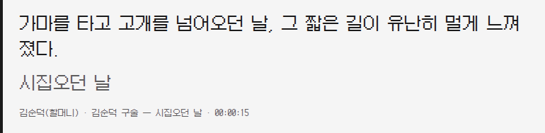

- **구술 인용**: 왼쪽 4px 먹색 선과 `paper-sunken` 면을 쓰고, 인용문은 본문 24px 이다. 원문에서 한 글자도 고치지 않는다.

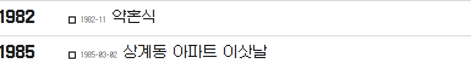

- **연표 블록**: 해(heading)와 항목(본문 24px)으로 쓴다. 사건은 먹색 네모, 자료는 빈 네모로 구분한다.
- 그 밖의 블록: 글(본문), 소제목(4px 선 + heading), 자료(사진 + 설명 + 메타), 사진 묶음(정사각 격자)이 있다.

---

## 7. 화면

### 인트로 `/intro`

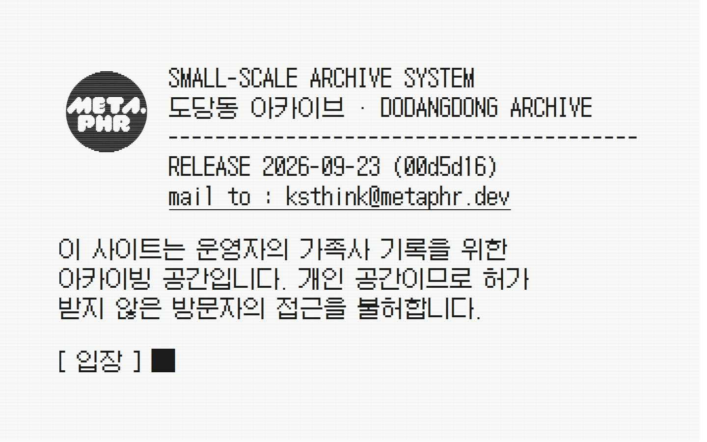

사이트의 문이다. 로그인하지 않은 사람은 어느 주소로 오든 여기로 온다.
낡은 단말기 화면을 흉내 냈다 — 만듦새는 CodePen 의 *Fallout Terminal Inspired CSS Theme* 에서 가져왔고,
녹색 형광체 대신 이 사이트의 종이색·먹색을 쓴다.

글꼴도 갈무리다. 기계가 제 이름을 대는 머리글과 입력칸만 고정폭(GalmuriMono11)이고,
사람에게 하는 말은 Galmuri11 이다. 사이트에서 가장 큰 글자를 쓴다 — 48/60 이고,
낮은 창(높이 800px 이하)에서는 36/48, 좁은 화면(900px 이하)에서는 24/36 으로 내린다.
셋 다 갈무리의 12px 격자 위에 있다.

단말기 화면은 **창 한가운데** 놓인다(가로·세로 모두). 글줄은 왼쪽에 맞춘다.

**이 화면에만 허락한 예외는 하나뿐이다.** 다른 어떤 화면도 이것을 따라 하지 않는다.

| 예외 | 까닭 |
| --- | --- |
| 움직인다 | 8초마다 훑고 지나가는 줄과, 첫 방문의 부팅 연출. `globals.css` 의 `* { animation: none !important }` 를 `.intro` 안에서만 `!important` 로 되돌린다 |

- 주사선은 가만히 깔린 무늬다. **깜빡이지 않는다** — 화면이 떠는 효과는 두지 않는다.
- 왼쪽 위는 META.PHR 로고다. 주사선이 그어진 둥근 판이며, 이 화면 전용 그림이다
  (`/brand/metaphr-crt.png`, 432px). 그림에 이미 줄이 그어져 있으므로 CSS 로 덧입히지 않는다.
  꼬리말에는 그림을 두지 않는다 — 거기서는 `©metaphr` 라고 글자로만 적는다.
- **로고는 216px 로 놓는다.** 원본(1254px)의 줄무늬 한 주기가 17.4px 이라, 216px 에서 정확히 3px —
  화면에 깔린 주사선과 같은 주기다. 크기를 바꾸면 두 결이 어긋나 로고만 따로 논다.
  좁은 화면에서도 줄이지 않고, 대신 글 위로 올린다.
- 오른쪽은 기계가 제 이름을 대는 머리글이다. 배포한 날짜와 배포번호(커밋 일곱 자리)를 적고,
  마지막 줄 `mail to : ksthink@metaphr.dev` 는 편지 링크다. 머리글보다 한 단계 작고(48 → 36),
  밑줄은 긋지 않는다 — 올리면 먹색으로 뒤집혀 누를 수 있음을 알린다.
- 단추는 `[ 입장 ]` 처럼 대괄호로 감싼다. 커서는 네모(`█`)이고, **깜빡이지 않는다.**
- 입력칸은 테두리 없이 밑줄(2px) 하나로 긋는다.
- 부팅 연출(줄이 한 줄씩 떨어지는 것)은 **그 브라우저의 첫 방문에만** 돈다. 두 번째부터는 곧바로 다 그려진다.
- 움직임을 줄여 달라고 한 사람에게는 모두 멈춘다(`prefers-reduced-motion`).

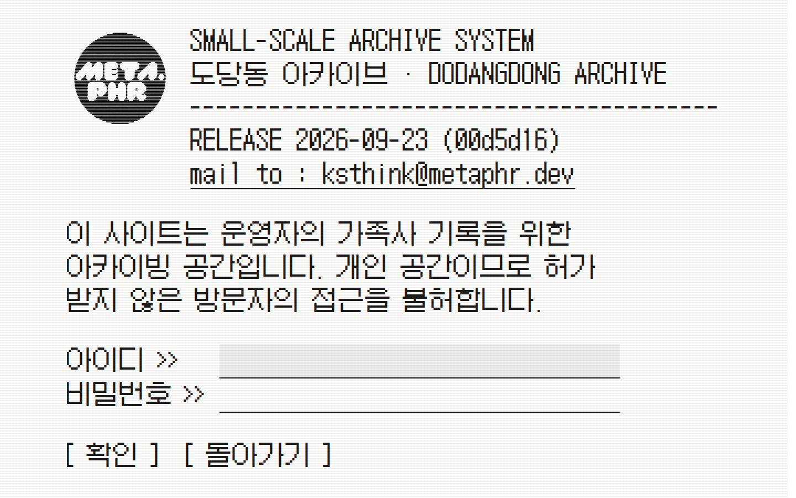

### 첫 화면 `/`

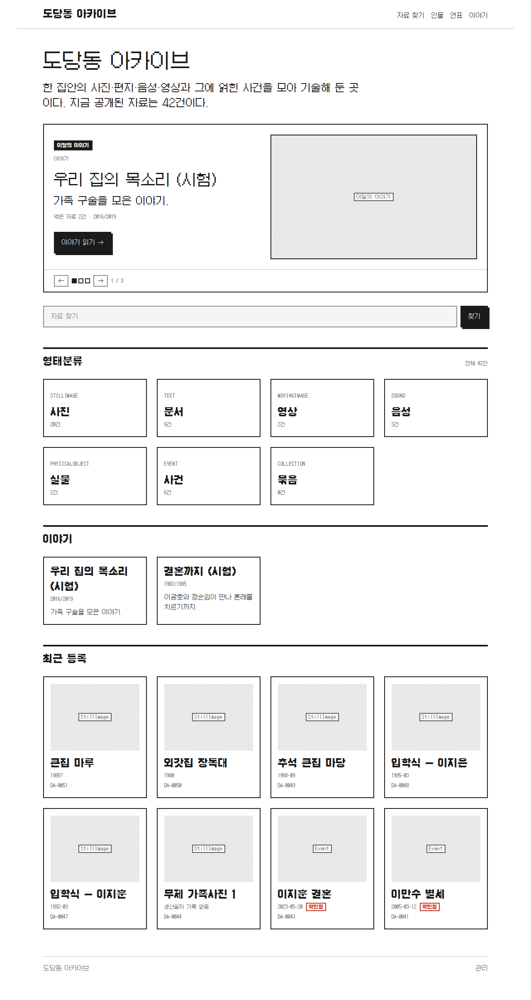

위에서부터 사이트 이름(display), 한 줄 소개, 히어로, 찾기, 형태분류 카드, 이야기, 최근 등록 순서다.
문(인트로)을 지나온 사람이 처음 만나는 화면이며, 여기서부터는 로그인 이야기를 다시 꺼내지 않는다.

### 자료 찾기 `/search`

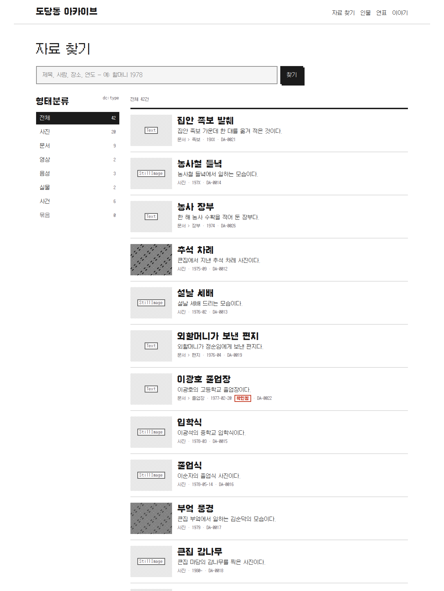

### 자료 상세 `/item/DA-0001`

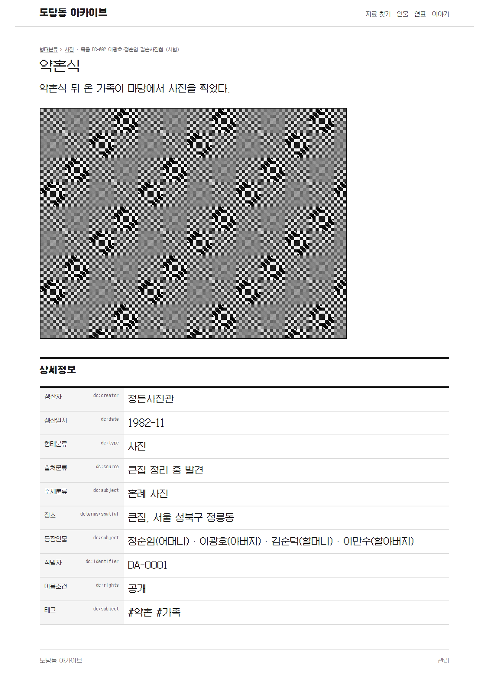

- 위에서부터 경로(형태분류 > 유형 · 묶음), 제목, 설명(본문), 원본, 상세정보 표 순서다.
- 사진은 원본 비율 그대로 2px 먹색 테두리 안에 둔다. 누르면 원본이 열린다.

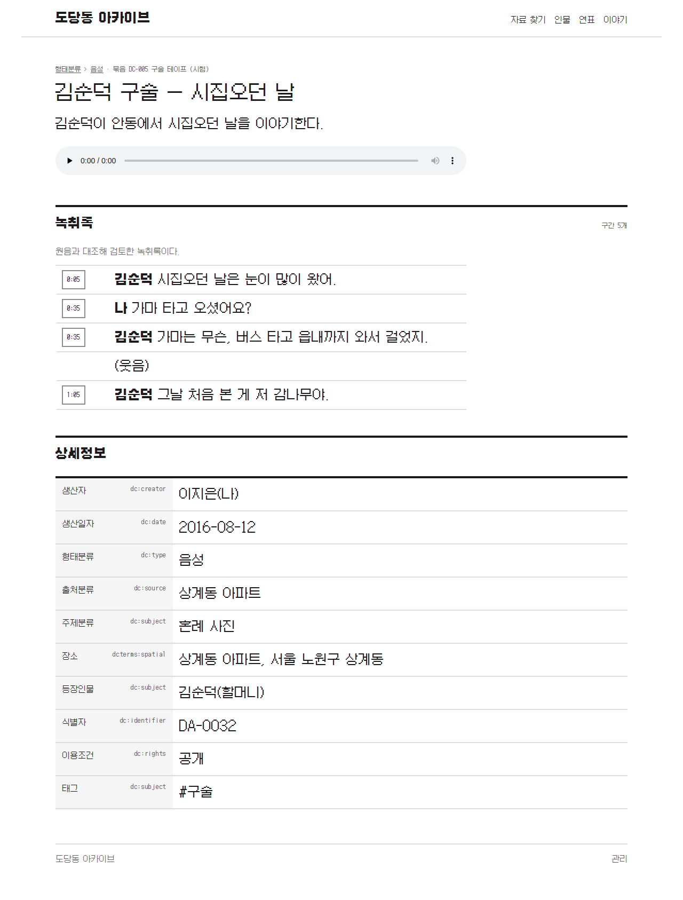

- 음성·영상은 브라우저 기본 재생기를 쓴다. 그 아래에 녹취록이 온다.
- **녹취록이 있는 음성**은 재생기 위에 지금 대목을 띄운다(`src/components/transcript-player.tsx`).
  들어간 면에 2px 먹색 테, 높이 420px(좁은 화면 300px). 지나간 줄과 올 줄을 위아래로 함께 두고
  **지금 대목만 짙다**(나머지는 `ink-muted`·불투명도 0.38). 재생을 따라 그 줄이 가운데로 흐르고,
  대목이 바뀔 때만 0.25초 물들듯 넘어간다 — `.lyrics-group` 안에서만 `transition` 을 되돌려 쓴다.
  시각이 같은 줄과 시각 없는 줄(`(웃음)`)은 **한 대목**으로 묶인다. 누르면 그 자리부터 듣는다.
- **녹취록이 없는 음성은 재생기만 둔다.** 빈 상자도, 대신 채우는 그림도 두지 않는다.

### 인물 `/people`

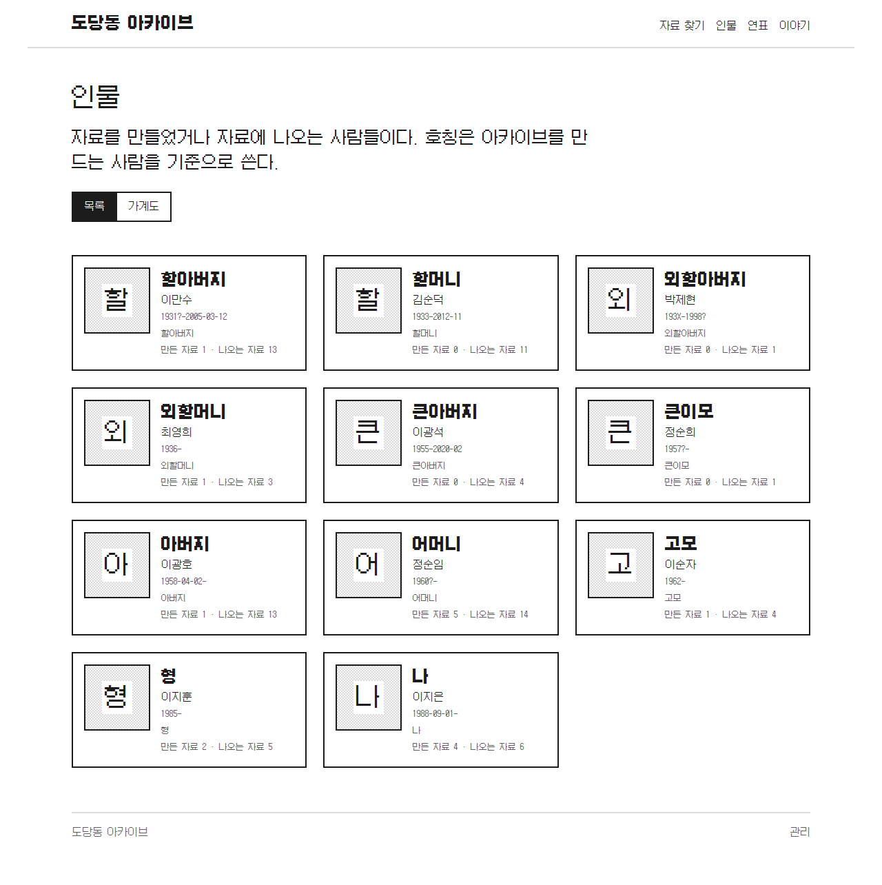
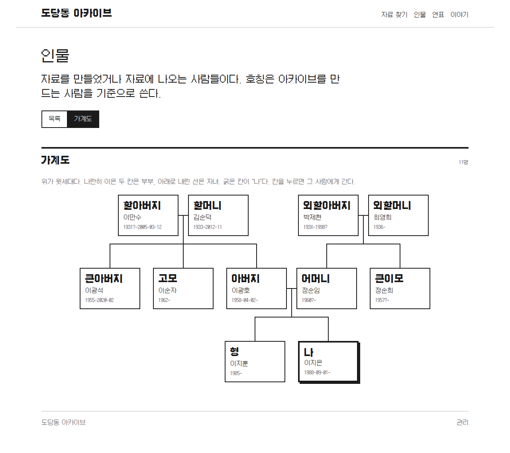

- 목록과 가계도는 `.view-switch` 로 전환한다. 두 칸짜리 상자이고, 고른 쪽을 먹색으로 채운다. 주소로 구분한다(`?view=tree`).
- 가계도에 들지 않는 사람(측근·지인)은 아래 "가계도 밖의 인물"에 목록 카드로 모인다.

### 인물 상세 `/people/DP-005`

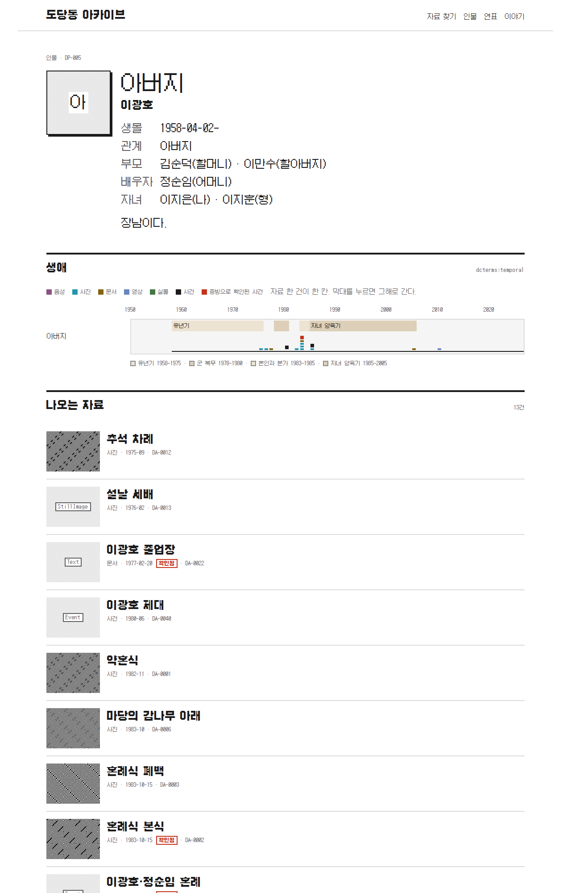

- 얼굴 자리(144px, 계단 그림자), 호칭(title), 본명(heading)이 오고, 이어서 사실 목록(본문 24px)이 온다.
- 그 아래에 생애 띠, 나오는 자료, 만든 자료가 있다.

### 연표 `/chronicle`

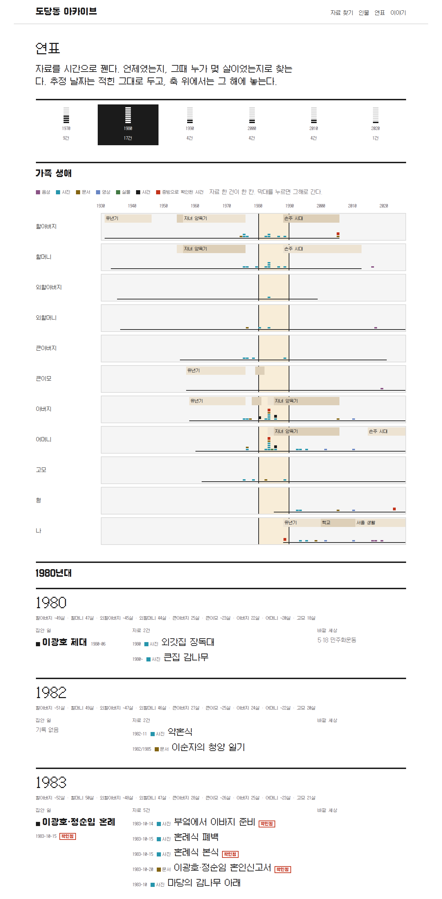

### 이야기 `/story/[id]`

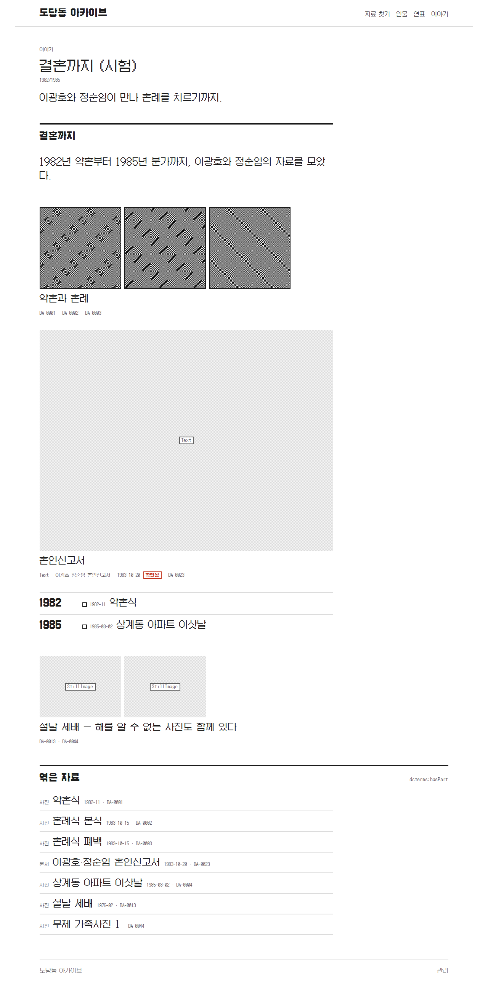

### 로그인 `/login`

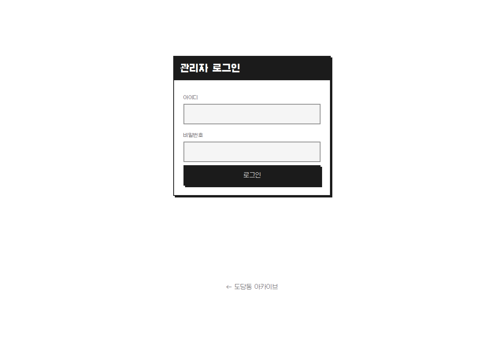

- 화면 가운데에 픽셀 창 하나(`.window`)를 둔다. 머리는 먹색 띠이고 몸통에 입력칸 둘을 둔다.

### 관리 화면

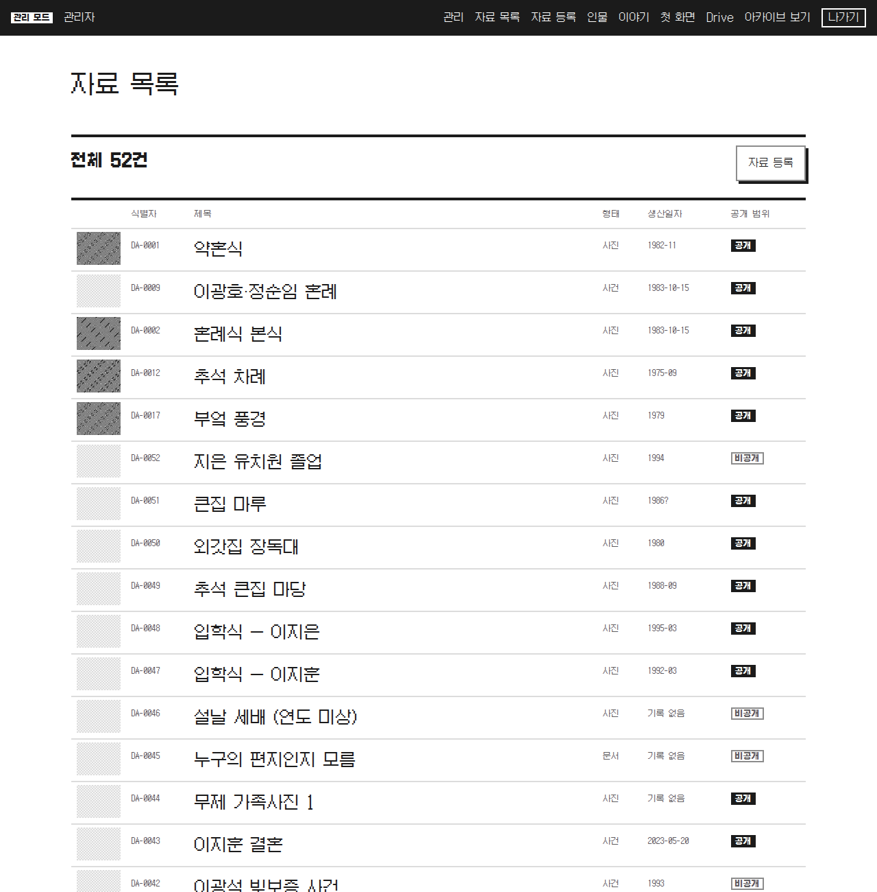

- 자료 목록은 표다. 머리 위는 4px 선, 행 사이는 `rule` 이다. 공개 범위는 딱지 모양으로 구분한다.

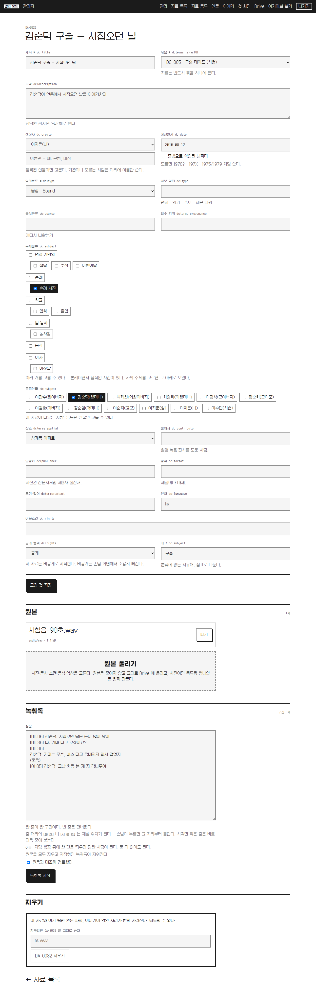

- 양식은 2열이고, 설명과 주제분류만 두 칸 폭을 쓴다. 칸마다 이름표 옆에 더블린코어 요소 코드를 둔다.
- 원본 올리기는 점선 영역이다. 파일을 끌어오면 4px 실선으로 바뀐다.
- 녹취록 칸이 있고, 지우기는 4px 상자 안에서 식별자를 똑같이 적어야 할 수 있다.

**인물 편집의 얼굴 자르기** — 이 사이트에서 유일하게 사진 위를 직접 가리키는 화면이다.
사진을 **누르면 그 자리가 네모의 가운데**가 되고, 크기는 슬라이더로 바꾼다. 끌어서 옮기지 않는다 —
이 사이트에는 끌어 움직이는 것이 하나도 없고, 누르기와 슬라이더면 키보드로도 그대로 된다(화살표키로 민다).
네모는 2px 먹색 테두리이고 그 바깥은 종이색으로 덮어 고른 자리만 또렷하게 남긴다. 옆에는 144px 미리보기를 둔다.

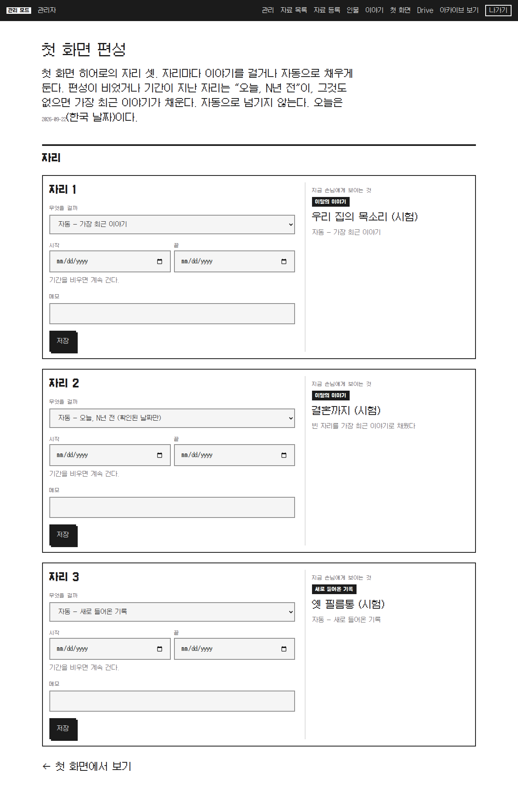
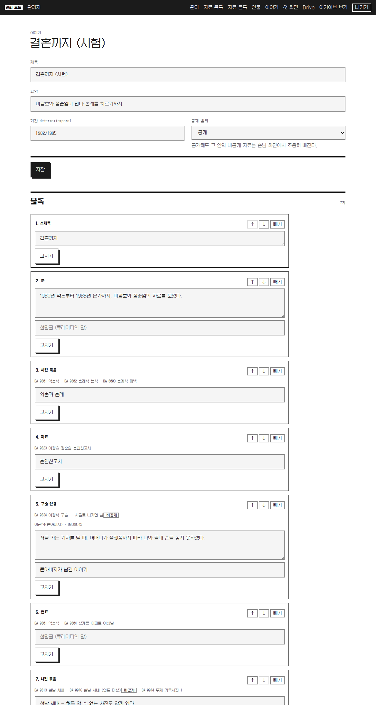

---

## 8. 밝은 화면 하나뿐

- 어두운 테마는 **두지 않는다.** 운영체제나 브라우저가 다크 모드여도 종이색 그대로 보인다.
- `color-scheme: only light` 를 선언한다(`globals.css` 의 `html`, 레이아웃의 `viewport`).
  입력칸·스크롤바도 밝게 그려지고, 휴대폰 Chrome 의 "웹 콘텐츠 자동 어둡게"도 사이트를 뒤집지 않는다.
- 토큰도 밝은 값 하나씩만 있다(`design/tokens.json`).
- `scrollbar-gutter: stable` 로 스크롤막대 자리를 늘 비워 둔다. 내용이 짧아 막대가 사라지는 화면
  (예: 자료 찾기에서 음성·영상·물건만 고른 경우)에서 본문이 7~8px 옆으로 움찔하는 것을 막는다.

---

## 9. 좁은 화면

| 첫 화면 | 자료 찾기 | 자료 상세 |
| --- | --- | --- |
| 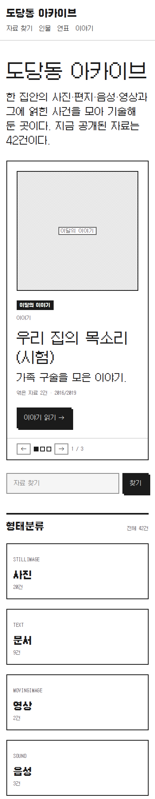 | 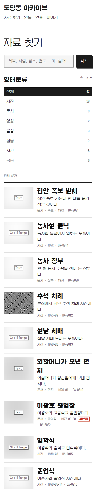 | 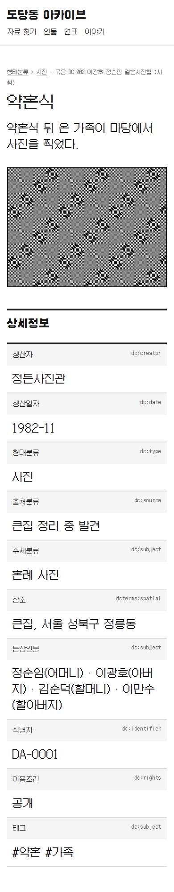 |

| 가계도 | 연표 | 이야기 |
| --- | --- | --- |
| 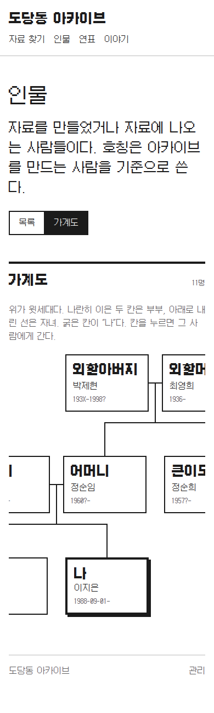 | 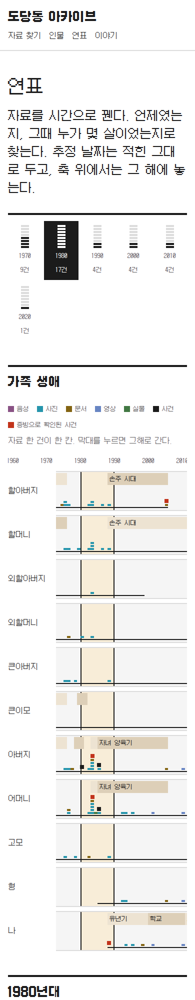 | 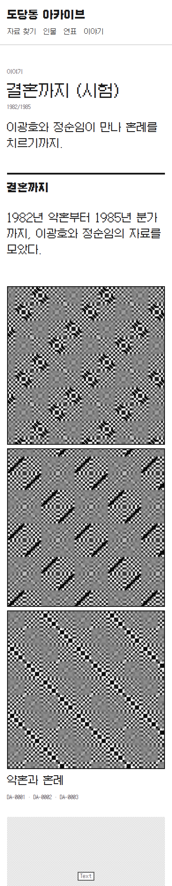 |

| 인트로 |
| --- |
| 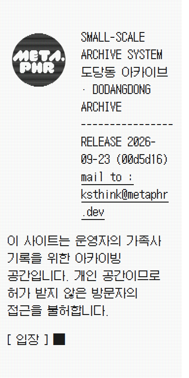 |

- 페이지는 가로로 넘치지 않는다. 옆 여백은 16px 이다.
- **넓은 그림은 상자 안에서만 가로로 민다.** 생애 띠와 가계도가 그렇다. 처음에는 봐야 할 곳이 가운데에 온다(지금 연대, "나").
- 인트로는 글자가 24/36 으로 내려가고, 로고가 128px 이 되며, 아이디·비밀번호 칸이 이름표 아래로 내려간다.
- 히어로는 사진이 위, 글이 아래로 간다. 상세정보 표는 요소명이 위, 값이 아래로 간다. 녹취록은 시각이 말 위로 올라간다.

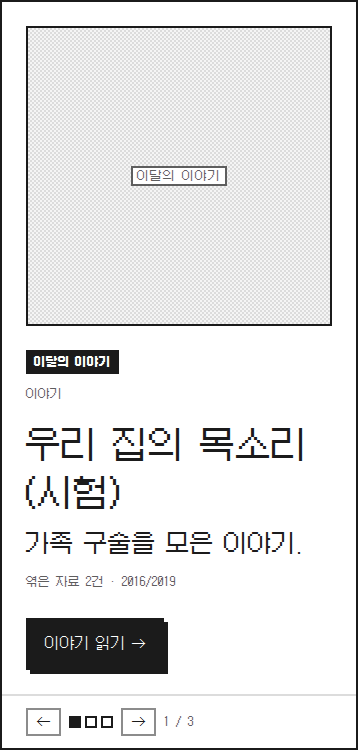

---

## 10. 접근성

- **포커스**: 모든 조작 요소에 `ink` 2px 실선을 2px 떨어뜨려 두른다(`:focus-visible`).
- **대비**: 본문은 종이 위 17:1, 보조 글자 6.5:1, 조작 테두리 3.4:1, 인장색 5.6:1 이다.
- **색만으로 말하지 않는다**
  - 유형 색에는 늘 유형 이름이 붙는다.
  - 공개·비공개는 딱지 모양으로 구분한다.
  - "확인됨"은 글자로 적는다.
- **그림은 글로도 둔다**
  - 가계도의 선은 화면 읽기 프로그램용 목록("할아버지·할머니의 자녀: …")으로 함께 낸다.
  - 생애 띠의 막대마다 "아버지 1983년: 혼례식 본식 | 1983-10-15 | 사진, …" 처럼 그해 자료를 읽어 주는 이름을 붙인다.
- **키보드**: 히어로는 ←/→ 로 넘긴다. 녹취록 시각은 버튼이다. 연표 막대와 가계도 칸은 링크다.
- **지금 위치**: 보기 전환과 녹취록 지금 구간에 `aria-current` 를 붙인다.

---

## 11. 하지 않는 것

- 둥근 모서리, 흐린 그림자, 그라데이션, 반투명 유리 효과를 쓰지 않는다.
- 애니메이션, 전환 효과, 자동 넘김, 스크롤 따라 움직이는 효과를 쓰지 않는다(인트로와 녹취록 재생기만 예외).
- 사진에 필터·세피아·흑백 처리를 하지 않는다. 사진은 원본 그대로 보인다.
- 인장색을 장식·링크·오류·"새 글" 표시에 쓰지 않는다. 연표 밖에서 유형 색을 쓰지 않는다.
- 12·15·24·36·48px 밖의 글자 크기, 흉내 낸 굵은체, 갈무리 밖의 글꼴을 쓰지 않는다.
- 비공개를 자물쇠나 흐린 칸으로 보여 주지 않는다. 손님에게는 없는 것이다.
- 모르는 값을 채워 넣지 않는다. "기록 없음"이나 `?` 로 둔다.

---

## 12. 알려진 틈

지금 화면에서 이 문서의 원칙과 어긋나는 곳이다. 고칠 때 이 목록에서 지운다.

| 어디 | 무엇이 | 제안 |
| --- | --- | --- |
| 체크박스(양식, 주제 칩, 검토 표시) | 브라우저 기본 **파란색**으로 그려진다. 흑백 원칙에서 벗어난다 | `accent-color: var(--ink)` 또는 픽셀 체크박스 |
| 이야기의 자료 블록 — 사진이 없는 자료 | 문서·사건 자료가 본문 폭 전체의 큰 빈 디더 면으로 나온다(이야기 화면의 "혼인신고서") | 사진이 없으면 썸네일 크기로 줄이거나 유형 딱지만 둔다 |
| 날짜 입력의 달력(첫 화면 편성) | 브라우저가 그리는 창이라 글꼴·모양을 바꿀 수 없다. 입력칸 글자는 갈무리다 | 필요하면 `YYYY-MM-DD` 글자 입력으로 바꾼다 |
| 음성·영상 재생기 | 브라우저 기본 모양이라 둥근 모서리와 회색 톤이 섞인다. 녹취록 음성은 위에 대목 상자를 얹었지만 단추는 그대로다 | 필요하면 픽셀 재생 단추로 바꾼다 |
| `viewer-*`, `--shadow-pixel-sm` | 토큰은 있지만 쓰는 화면이 없다(사진 뷰어를 아직 만들지 않았다) | 뷰어를 만들 때 쓴다 |

---

## 13. 고치는 법

1. **값**(색·크기·간격)은 `design/tokens.json` 에서 고친다. 그리고 `npm run tokens` 를 돌린다. `src/app/tokens.css` 는 직접 고치지 않는다.
2. **모양**은 `src/app/globals.css` 에서 고친다. 거기서는 토큰만 쓰고, 색이나 크기를 직접 적지 않는다. 예외는 부품 고유의 치수(가계도 칸 152px 같은 것)뿐이다.
3. 새 글자 크기가 필요하면 먼저 12·15·24·36·48 중에서 고른다. 없으면 갈무리 글꼴의 격자 배수인지 확인한다.
4. 스크린샷은 로컬 서버를 띄워 다시 찍고 `docs/design/` 에 덮어쓴다.
   - 손님 관점으로 찍고, 관리자 이름·실제 사용자 사진은 싣지 않는다.
   - 넓은 화면(1280)과 휴대폰(390)을 모두 찍는다.
